#OrCAD说明

本文为设计原理图的过程记载。

通过查看px4官方原理图可以发现，主处理器为stm32f427，在FMU SoC Ports FRAM这页可以发现，协处理器为stm32f103，在IO SoC Ports Spektrum/DSM port这页可以发现。其中处理器是以端口的形式出现在相应类别的页码中，而不是以我们平常画原理图芯片元件整体的形式，所以注意理解这个。

电源流行分析：电流计出来的VDD_5V_IN -> 分流为IO-VDD_5V5,VDD_5V_PERIPH和VDD_5V_HIPOWER，但是我们舍弃了VDD_5V_HIPOWER，而VDD_5V_PERIPH用于给外接器件供电 -> 然后VDD_5V_PERIPH还通过稳压芯片转换出FMU-VDD_3V3和IO-VDD_3V3，FMU-VDD_3V3给stm32f427及传感器供电，IO-VDD_3V3给stm32f103供电。

更多参考[pixhawk飞控介绍](http://www.docin.com/p-1092528341.html)/[看看pixhawk的无赖设计](http://www.docin.com/p-757319248.html)

1. 建立工程

	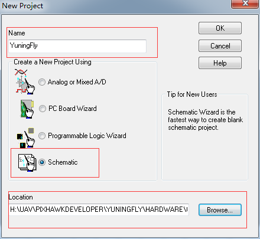

2. (可选)添加[标题栏](http://jingyan.baidu.com/article/e52e36154467e940c60c5187.html)TitleBlock0

3. [新建元件库](http://wenku.baidu.com/link?url=DZptfwWOgny_4ejvw0WVvdqtp3VgsoHT-yGHt6wsm5c1NJOCFY3XP785GMzvEdvsZaiIEJOPT90HGhJvafOW3MPGFWrTl4v8kh2h3J7UwQ7)yuningfly.OLB，并创建新在元件如：stm32f407

	

	当你在创建页面更改了元件，需要在原理图中更新时，点击Update Cache进行更新即可

	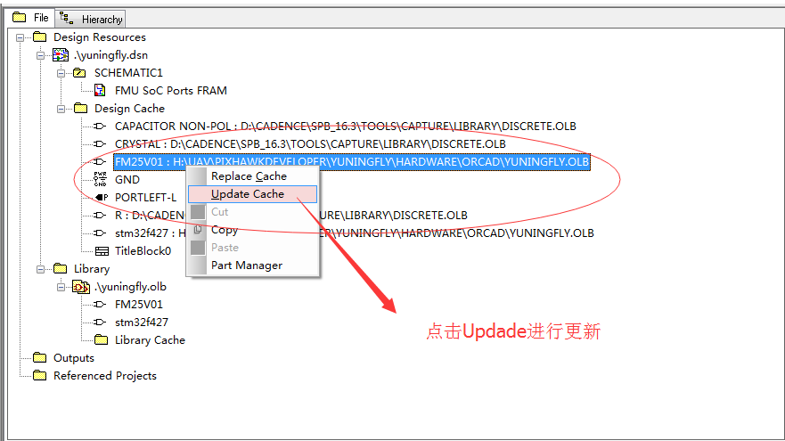

4. 添加元件库

	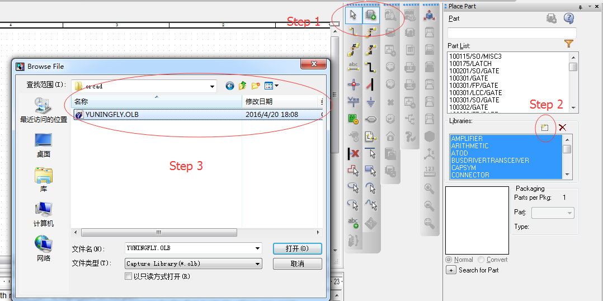

5. 放置元件到原理图，如果能记住元件在名字可以进行全局搜索，万一不记得上网搜索如晶振为CRYSTAL，或者直接在库里进行查找，如常用的库为DESCRETE

	

6. (可选)如果原理图页面过小，可以修改原理图的大小

	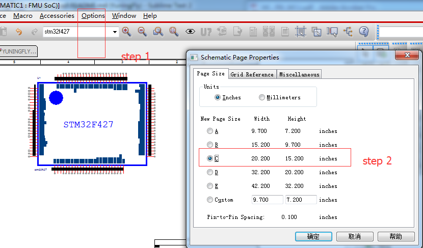

7. 连线，可以使用快捷键w，注意这里不能为红色，否则线连的不是很整齐。

	

8. (可选)为了使元件编号有序，可以元件重新编号。

	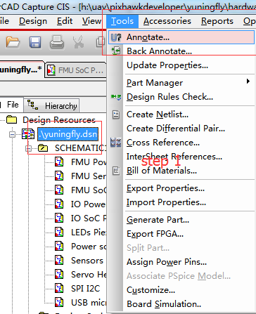

	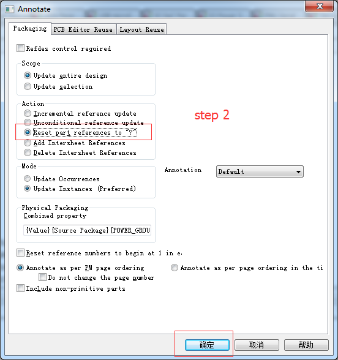

	

9. 添加元件封装，可以有两种方式，封装的名字为在PADS里面使用的元件的名字。

	1、先进入Project Manager，选择顶层原理图，选Edit－Browse Parts，用点击和Shift＋点击选择所有元件，再选菜单Edit－Property。找到PCB Footprint那项，可以逐个填入，相同封装填一个，然后copy，再Paste。

	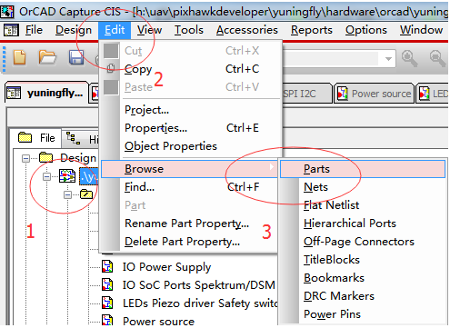

	2、一页一页修改，打开某页，框选中当前页所有器件，再点右键，选属性，在弹出对话框中按要修改REF排序，用左键拖拉要修改的为同种封装器件再点右键，然后击EDIT，填入封装就成批修改了。

	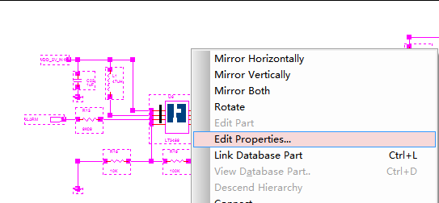

	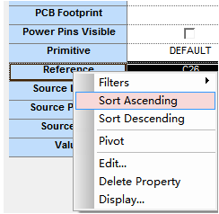


10. DRC检查语法错误。

	

	出现如下信息，证明是没有问题。

	```
	--------------------------------------------------
	Checking Schematic: SCHEMATIC1
	--------------------------------------------------
	Checking Electrical Rules 

	Checking For Single Node Nets

	Checking For Unconnected Bus Nets
	```

11. 创建网表，可供PADS使用绘画PCB。

	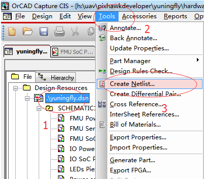

	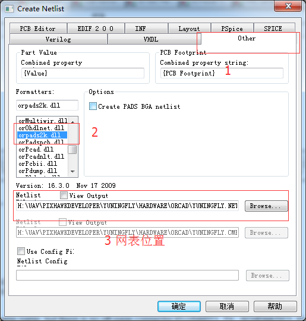

